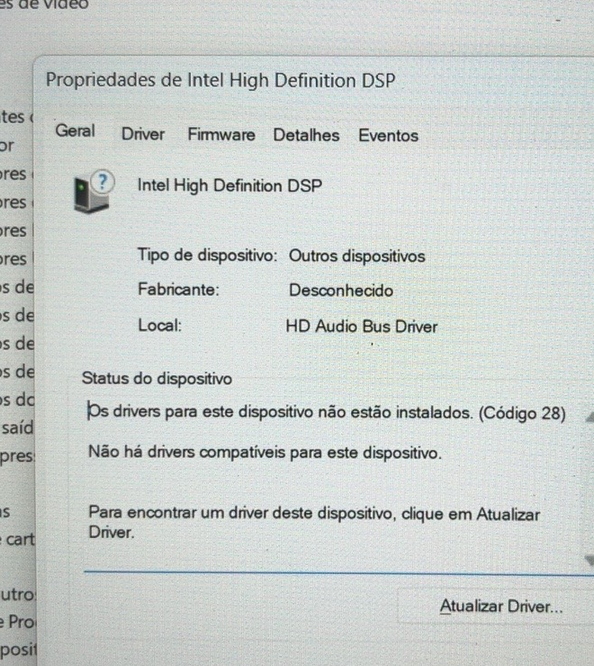
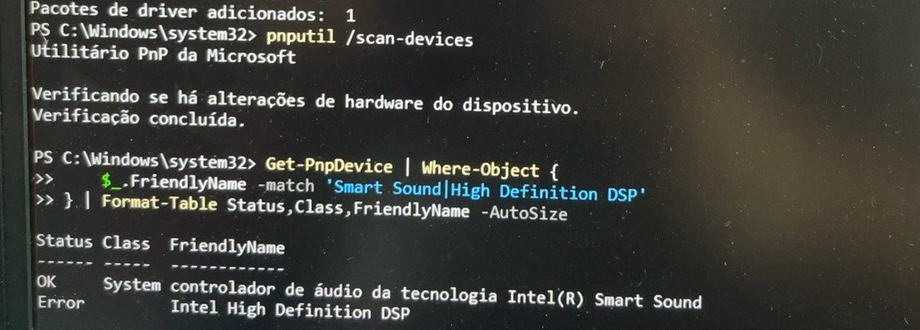
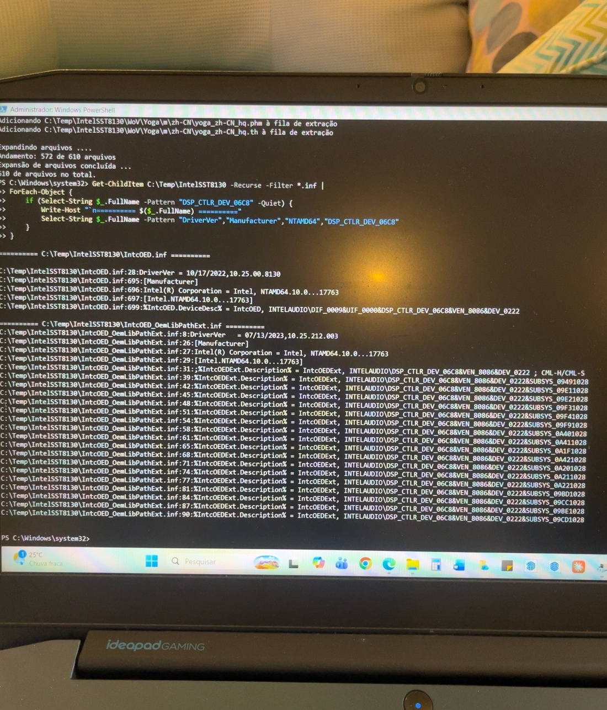
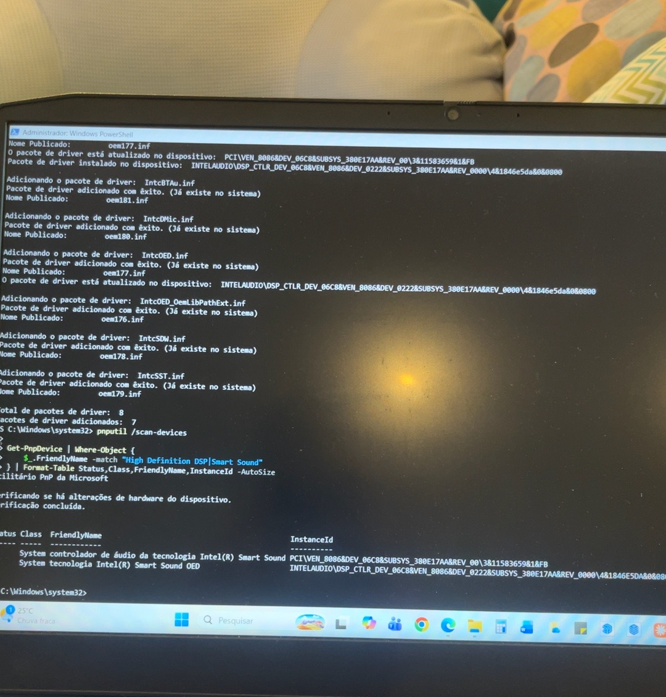

# Intel High Definition DSP Code 28 Fix
## Lenovo IdeaPad Gaming 3 15IMH05 (82CG)

A troubleshooting and recovery guide for the **Intel High Definition DSP – Code 28** audio issue on the Lenovo IdeaPad Gaming 3 15IMH05.

This repository documents the investigation that led from a completely missing audio device to a working **Intel Smart Sound Technology (Intel SST) OED** driver.

> **Tested on:** Lenovo IdeaPad Gaming 3 15IMH05 (82CG)  
> **Operating System:** Windows 11 64-bit  
> **Affected component:** Intel High Definition DSP / Intel Smart Sound Technology  
> **Working OED driver:** Intel SST OED `10.25.0.8130`

---

## Problem

The laptop had no working audio output.

In Windows Device Manager, the following device appeared under **Other devices** with a warning icon:

```text
Intel High Definition DSP
```

Device Manager reported:

```text
The drivers for this device are not installed. (Code 28)
There are no compatible drivers for this device.
```

### Evidence — Code 28



*Intel High Definition DSP detected by Windows without an installed compatible driver.*

Installing the official Lenovo audio package and asking Windows to automatically search for a driver did not solve the issue.

---

## Hardware identification

The affected device reported the following Hardware ID:

```text
INTELAUDIO\DSP_CTLR_DEV_06C8&VEN_8086&DEV_0222&SUBSYS_380E17AA&REV_0000
```

and the following Compatible ID:

```text
INTELAUDIO\DIF_0009&UIF_0000&DSP_CTLR_DEV_06C8&VEN_8086&DEV_0222
```

The parent Intel Smart Sound controller was detected correctly by Windows, while the DSP child device remained in an error state.

This was an important distinction: the Intel audio controller itself was working, but Windows could not associate a compatible OED driver with the DSP device.

---

## Initial troubleshooting

The following approaches were tested before manually installing another driver:

- Windows automatic driver search
- Device Manager driver update
- [Official Lenovo Support](https://pcsupport.lenovo.com/) audio driver package for the IdeaPad Gaming 3 15IMH05
- Hardware rescan
- Existing Intel SST/OED packages in the Windows Driver Store

The problem remained:

```text
Intel High Definition DSP
Status: Error
Problem: CM_PROB_FAILED_INSTALL
Code: 28
```

---

## Inspecting the device with PowerShell

The Intel audio devices can be inspected with:

```powershell
Get-PnpDevice | Where-Object {
    $_.FriendlyName -match "Smart Sound|SST|High Definition DSP"
} | Format-Table Status,Class,FriendlyName,InstanceId -AutoSize
```

In this case, the result showed that the Intel Smart Sound controller was working while the Intel High Definition DSP was not.

### Evidence — DSP diagnosis



*The Intel Smart Sound controller was operational while the DSP child device remained in an error state.*

The device properties also confirmed:

```text
CM_PROB_FAILED_INSTALL
Code 28
```

---

## SetupAPI investigation

Windows driver installation activity was also checked through the SetupAPI logs.

For the affected DSP device, Windows reported:

```text
There are no compatible drivers for this device.
```

The relevant device was:

```text
INTELAUDIO\DSP_CTLR_DEV_06C8&VEN_8086&DEV_0222&SUBSYS_380E17AA
```

This indicated that the hardware was being detected correctly, but Windows could not select an appropriate driver for it.

---

## Finding a compatible Intel SST OED driver

The device's Hardware ID and Compatible ID were used to search the [Microsoft Update Catalog](https://www.catalog.update.microsoft.com/).

The driver used in this case was obtained directly from Microsoft's catalog rather than from a third-party driver repository.

A package containing:

```text
Intel(R) Smart Sound Technology (Intel(R) SST) OED
Version: 10.25.0.8130
```

was found.

The Microsoft Update Catalog package was listed for:

```text
Intel(R) Corporation - System - 10.25.0.8130
Intel(R) Smart Sound Technology (Intel(R) SST) OED
Architecture: AMD64
```

Before installing it, the package was extracted and its INF files were inspected.

The package contained:

```text
IntcOED.inf
DriverVer = 10/17/2022,10.25.00.8130
```

### Evidence — INF validation



*The extracted Intel SST package explicitly contains support for `DSP_CTLR_DEV_06C8`.*

Most importantly, the INF explicitly supported:

```text
INTELAUDIO\DIF_0009&UIF_0000&DSP_CTLR_DEV_06C8&VEN_8086&DEV_0222
```

which matched the Compatible ID reported by the affected device.

This match was the key validation before attempting the installation.

---

## Extracting and validating the driver

After downloading the CAB from the [Microsoft Update Catalog](https://www.catalog.update.microsoft.com/), create a temporary directory and extract it.

Open **PowerShell as Administrator**:

```powershell
$dest = "C:\Temp\IntelSST8130"

New-Item -ItemType Directory -Path $dest -Force | Out-Null

expand.exe -F:* "PATH_TO_DOWNLOADED_DRIVER.cab" $dest
```

Search the extracted INF files for the affected DSP:

```powershell
Get-ChildItem C:\Temp\IntelSST8130 -Recurse -Filter *.inf |
ForEach-Object {
    if (Select-String $_.FullName -Pattern "DSP_CTLR_DEV_06C8" -Quiet) {
        Write-Host "`n========== $($_.FullName) =========="
        Select-String $_.FullName -Pattern `
            "DriverVer","Manufacturer","NTAMD64","DSP_CTLR_DEV_06C8"
    }
}
```

Do not proceed only because the driver version is the same as the one documented here.

Always verify that the package supports your own **Hardware ID or Compatible ID**.

---

## Installing the driver

Once compatibility has been verified, open **PowerShell as Administrator** and run:

```powershell
pnputil /add-driver "C:\Temp\IntelSST8130\*.inf" /subdirs /install
```

Then rescan the devices:

```powershell
pnputil /scan-devices
```

Verify the Intel audio devices:

```powershell
Get-PnpDevice | Where-Object {
    $_.FriendlyName -match "High Definition DSP|Smart Sound"
} | Format-Table Status,Class,FriendlyName,InstanceId -AutoSize
```

---

## Result

Before:

```text
Intel High Definition DSP
Status: Error
Code: 28
```

After installing the compatible Intel SST OED package:

```text
Intel(R) Smart Sound Technology OED
Status: OK
```

The Intel Smart Sound controller also remained operational:

```text
Intel(R) Smart Sound Technology Audio Controller
Status: OK
```

### Evidence — Successful installation



*Final verification: both the Intel Smart Sound controller and Intel Smart Sound Technology OED are reported as OK.*

After rebooting Windows, the audio devices were correctly detected and **audio functionality was restored**.

---

## Root cause

The issue was not simply a missing Realtek audio driver.

The Intel Smart Sound controller itself was already detected and operational. The failure occurred at the DSP child device:

```text
Intel High Definition DSP
```

Windows detected the hardware but could not associate an appropriate OED driver with it, resulting in:

```text
CM_PROB_FAILED_INSTALL
Code 28
```

Installing an Intel SST OED package whose INF explicitly matched the DSP Compatible ID allowed Windows to correctly enumerate the device as:

```text
Intel(R) Smart Sound Technology OED
```

---

## Important notes

This procedure was tested specifically on:

```text
Lenovo IdeaPad Gaming 3 15IMH05
Machine Type: 82CG
Intel DSP: DEV_06C8
Lenovo subsystem: SUBSYS_380E17AA
```

Do **not** install this driver only because your laptop has a similar model name.

Check your Hardware ID first.

Driver compatibility can vary depending on the hardware revision, Windows version and OEM configuration.

Creating a restore point or backup before manually changing system drivers is recommended.

---

## Driver sources

Whenever possible, obtain drivers from official sources:

- [Lenovo Support](https://pcsupport.lenovo.com/)
- [Microsoft Update Catalog](https://www.catalog.update.microsoft.com/)

Avoid repackaged driver downloads from unknown third-party websites.

This repository does **not** redistribute the Intel driver package. It only documents the troubleshooting and installation procedure.

---

## Why this repository exists

Reports of **Intel High Definition DSP – Code 28** can be found online, including reports involving the IdeaPad Gaming 3.

However, the information required to diagnose the issue was spread across different sources.

The goal of this repository is to document the complete troubleshooting path that worked on this machine — from identifying the failing DSP device to validating the correct Intel SST OED driver before installation.

Hopefully this saves someone else a few hours of troubleshooting.

---

## Disclaimer

This repository documents a troubleshooting procedure that worked on one specific hardware configuration.

Use it as a diagnostic reference and verify compatibility with your own hardware before installing or modifying drivers.

Neither Lenovo, Intel nor Microsoft is affiliated with this repository.

---

## Author

**William Barreto**  
Software Engineer

If this guide helped you solve the same issue, consider giving the repository a ⭐ so other users can find it more easily.
